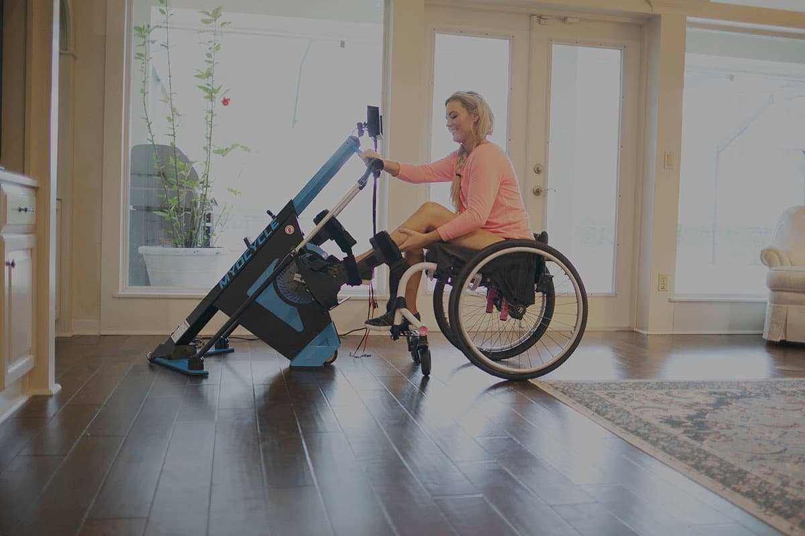

CorLife has been at the helm of the DME ship in workers’ compensation for a long time. We have seen a thing or two when it comes to Functional Electrical Stimulation (FES) bike options. There are only a few large players in this space. They are well-known, have great marketing and a strong presence at facilities of excellence. All in all, they make a great bike. The technology is on par with what is expected in a bike for someone recovering from a catastrophic injury. When the carrier hears the term “rehabilitative bike” or “exercise bike,” they know this comes with a large price tag. These bikes can range upwards of $25,000 for upper extremity (UE) and lower extremity (LE) stimulation. While completely appropriate for many injured workers, we believe they are overprescribed. They are technical, intimidating—and often confusing—to the injured worker and home health staff. This is why CorLife has been searching for an alternative and we are excited to say that we have recently found it!

Introducing … the MyoCycle! At nearly half the price, this is a strong competitor in today’s DME market. The MyoCycle FES Cycling Therapy System is centered around it’s easy-to-use design. Large buttons, easy-to-read display and simple setup allows for the focus to be on the exercise rather than the installation and routine adjustments. All chair attachments are located where the user can easily reach them to adjust as needed. The system was also designed from the ground up to minimize cost, making FES cycling therapy more affordable than ever before. MYOLYN created this equipment with the idea that anyone can set it up and use the machine, reducing the cost or need for a specialist to provide in-home setup and routine adjustments. 

We have found that the ease of the MyoCycle allows injured workers to feel more confident when being introduced to a rehabilitation bike. The physical and mental benefits from this high-quality therapy in the comfort of home can truly make a world of a difference after a catastrophic injury. Their sophisticated MyoPortal can even track users’ progress data and send motivational reports. Plus, it allows others access for clinical support, technical assistance and even gives workers’ compensation carriers the ability to track compliance. CorLife encourages you to consider this new alternative next time a rehabilitation bike is needed. You will be pleasantly surprised.    

Visit <a href="https://myolyn.com/for-home/stories/" target="_blank">myolyn.com</a> to read success stories from real MyoCycle users and contact CorLife to learn more.