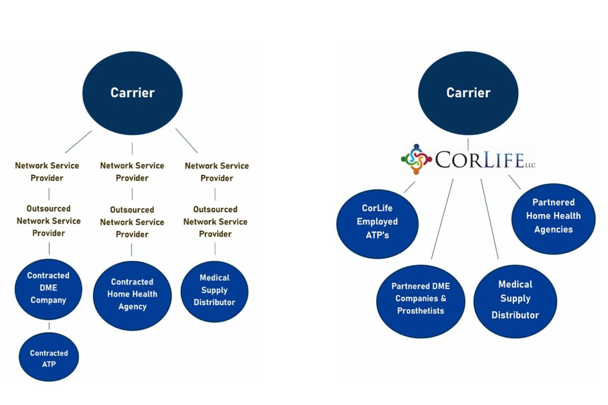

It’s time for spring cleaning! Eliminate what you don’t need, such as an unnecessary chain of network service providers. This month, we’ve illustrated a clear picture of what makes CorLife truly different from other network service providers.

On the left, you see a congested mess of different outsourced network service providers. Adjusters and nurse case managers become so far removed from the actual person providing care or equipment, they lose sight of their main contact. Also, each provider applies an up charge on care and equipment causing costs to skyrocket and the bills to become nontransparent.

On the right, you see a concise display of how CorLife executes each referral. This is because we do not outsource our referrals. One CorLife claim specialist personally locates one of our partnered, high-rated home health care agencies that is the best match for the injured worker and their family. We connect with one of our CorLife-employed ATPs who personally visits the injured worker to determine what equipment or repair is needed. Our claim specialist directly orders medical supplies for each claimant to ensure quantity and brand are correct. The people who know the claim the best speak directly to the nurses, prosthetists, physical therapists, ATPs or other health care professionals. We are in constant contact with the experts, relaying information to adjusters and nurse case managers. Our claim specialists even create invoices themselves to ensure each item has a description and the prices listed are accurate and agreed upon.

Overall, as you can see above, CorLife provides direct customer service. You will never wait on hold, and you will never be confused about who to contact regarding the status of a claim. You will always receive prompt, straightforward and quality service for every need of every claim.