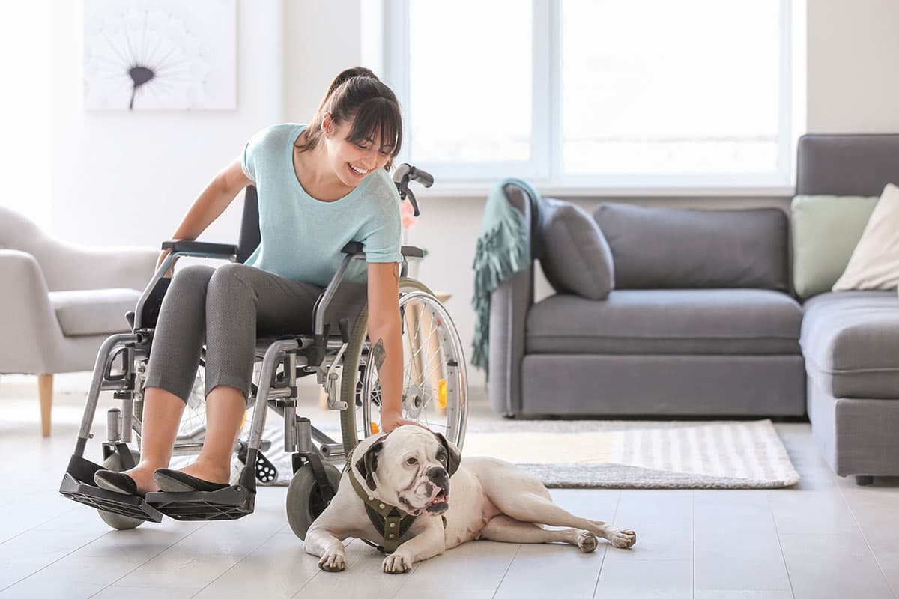

There’s an important service that is hard to come by in the world of workers’ compensation: Effective delivery and set up of ALL large durable medical equipment (DME).

Imagine your claimant is being discharged home with a large amount of medical equipment such as a Hoyer lift, hospital bed, power chair, manual chair, bathroom equipment, etc. How will each of these pieces of equipment be delivered on time to the right location without damage? How can you guarantee each of these items is set up correctly and ready for the injured worker? CorLife has the answer!

We employ our own Assistive Technology Professionals (ATPs) to move our injured workers’ belongings anywhere in the United States and Mexico. We can even facilitate the move short notice, as few as three days before the move date. This process includes full packing of DME, insured transport, plus unloading and assembly by certified ATPs. CorLife has been providing this service to some of the top carriers around the country with seamless execution.

Too often, equipment is damaged or lost by large freight carriers. Have you ever been told to pack your equipment on a pallet and have a courier move it for you? Has your injured worker ever required a last-minute move with a mountain of items that you need to coordinate? This is where CorLife can be exceptionally helpful. Using our own employed ATPs, we know exactly who is handling the equipment and can easily communicate with them at a moment’s notice. Our ATPs are in direct contact with our Claim’s Specialists to provide updates which are then sent to the adjuster and nurse case manager.

We have found this to be a critical niche in the catastrophic workers’ compensation market which we have made our specialty. Let CorLife provide your next move, worry-free.