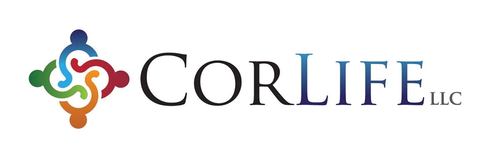

### _Inc._ Magazine Unveils Its Annual List of America’s Fastest-Growing Private Companies—the Inc. 5000

#### CorLife, LLC Ranks No. 1700 on the 2019 Inc. 5000 With Three-Year Revenue Growth of 240 Percent

<strong>NEW YORK, August 19, 2019</strong> – _Inc._ magazine revealed that CorLife, LLC is number 1700 on its annual Inc. 5000 list, the most prestigious ranking of the nation’s fastest-growing private companies. The list represents a unique look at the most successful companies within the American economy’s most dynamic segment—its independent small businesses. Microsoft, Dell, Domino’s Pizza, Pandora, Timberland, LinkedIn, Yelp, Zillow, and many other well-known names gained their first national exposure as honorees on the Inc. 5000.

“This is such an honor! Thank you to everyone who has given this company a chance to show how we can serve you and your claimants. We have had some amazing champions of our service over the past ten years. I am truly grateful and forever in debt to a few key champions who gave CorLife a chance ten years ago. They continue to believe we do workers’ compensation ancillary services better,” said Lauren Underhill, President, CorLife, LLC.

Not only have the companies on the 2019 Inc. 5000 (which are listed online at Inc.com, with the top 500 companies featured in the September issue of _Inc._, available on newsstands August 20) been very competitive within their markets, but the list as a whole shows staggering growth compared with prior lists. The 2019 Inc. 5000 achieved an astounding three-year average growth of 454 percent, and a median rate of 157 percent. The Inc. 5000’s aggregate revenue was $237.7 billion in 2018, accounting for 1,216,308 jobs over the past three years.

“The companies on this year’s Inc. 5000 have followed so many different paths to success,” says _Inc._ Editor-in-Chief James Ledbetter. “There’s no single course you can follow or investment you can make that will guarantee this kind of spectacular growth. But what they have in common is persistence and seizing opportunities.”

The annual Inc. 5000 event honoring the companies on the list will be held October 10-12, 2019, at the JW Marriott Desert Ridge Resort and Spa in Phoenix, Arizona. As always, speakers include some of the greatest innovators and business leaders of our generation.

Since 2010, CorLife, LLC has provided a suite of ancillary services to workers’ compensation insurance carriers nationwide including durable medical equipment, home health care, supplies, prosthetics, transportation and comprehensive home modifications. Founded on fair pricing, remarkable service and transparent billing, CorLife has revolutionized the claims-handling process to offer quick, effective and accurate management through the life of the claim. CorLife is a proud De Pere, Wisconsin, women-owned business. Learn more at corlifedfe.com.

<strong>CONTACT:</strong> 
Lauren Underhill 
President and CEO 
<a href="mailto:laurenu@corelifedfe.com">laurenu@corelifedfe.com</a> 
<a href="tel:888-770-7194">888-770-7194</a>

<strong>More about _Inc._ and the Inc. 5000</strong>

#### Methodology

The 2019 Inc. 5000 is ranked according to percentage revenue growth when comparing 2015 and 2018. To qualify, companies must have been founded and generating revenue by March 31, 2015. They had to be U.S.-based, privately held, for profit, and independent—not subsidiaries or divisions of other companies—as of December 31, 2018. (Since then, a number of companies on the list have gone public or been acquired.) The minimum revenue required for 2015 is $100,000; the minimum for 2018 is $2 million. As always, _Inc._ reserves the right to decline applicants for subjective reasons. Companies on the Inc. 500 are featured in Inc.’s September issue. They represent the top tier of the Inc. 5000, which can be found at <a href="http://www.inc.com/inc5000" target="_blank">http://www.inc.com/inc5000</a>.

#### About _Inc._ Media

Founded in 1979 and acquired in 2005 by Mansueto Ventures, _Inc._ is the only major brand dedicated exclusively to owners and managers of growing private companies, with the aim to deliver real solutions for today’s innovative company builders. _Inc._ took home the National Magazine Award for General Excellence in both 2014 and 2012. The total monthly audience reach for the brand has been growing significantly, from 2,000,000 in 2010 to more than 20,000,000 today. For more information, visit <a href="www.inc.com" target="_blank">www.inc.com</a>.

The Inc. 5000 is a list of the fastest-growing private companies in the nation. Started in 1982, this prestigious list has become the hallmark of entrepreneurial success. The Inc. 5000 Conference & Awards Ceremony is an annual event that celebrates the remarkable achievements of these companies. The event also offers informative workshops, celebrated keynote speakers, and evening functions.

For more information on _Inc._ and the Inc. 5000 Conference, visit <a href="http://conference.inc.com/" target="_blank">http://conference.inc.com/</a>.
