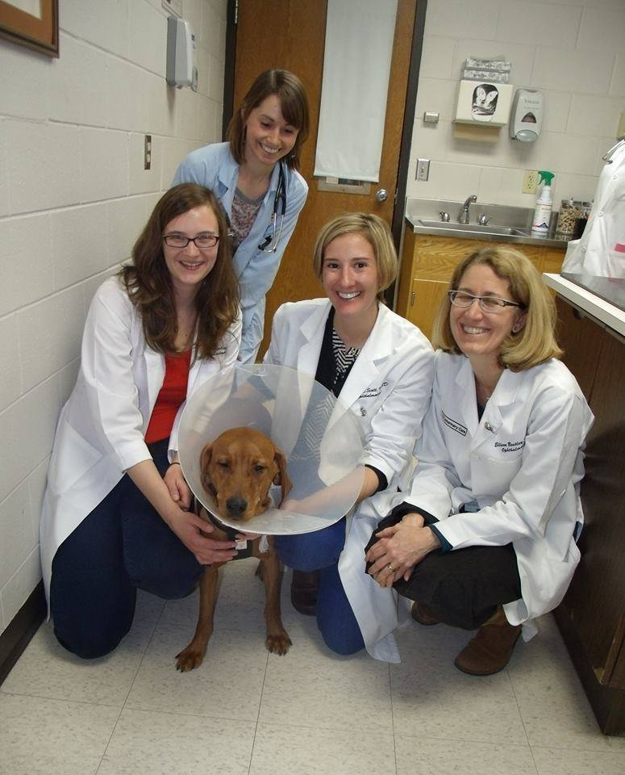
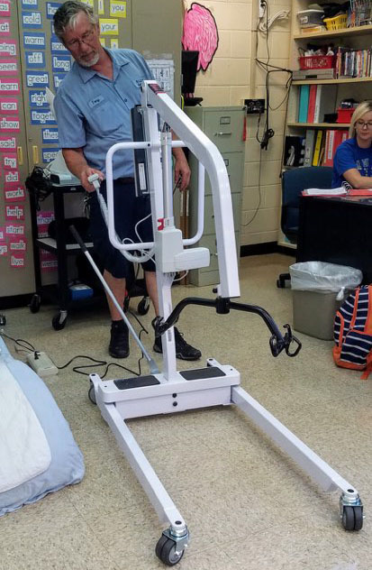

This time of year is known for giving, generosity and kindness. At CorLife, that’s our approach all year long. President/CEO Lauren Underhill believes as a business owner, there’s an obligation to give back to the communities CorLife serves. To show our appreciation, here are some ways CorLife lended a helping hand:

* An adorable coonhound mix named Spinner needed eye surgery to see the world around her again. CorLife gifted her the eye surgery at UW Veterinary Care in Madison, Wisconsin. Fully recovered, Spinner stared out the car window the entire way home!
* Three saint bernards were devastatingly found living outside tied to a chain. The Illinois Saint Bernard Rescue contacted us for help and we donated two weeks of shelter and covered the vet bills for all three dogs.
* There are many single occupant homeless shelters, but not a lot of places for families. CorLife funded a transitional living wing for homeless families at First United Methodist Church in downtown Green Bay, Wisconsin. The new wing will include four units to provide shelter for four families in need.
* Dianne Febles, a teacher at Fernandina Beach High School, needed a patient lift for her Exceptional Student Education classroom. Dianne utilized social media and the rest is history:

> “This donation [drive electric patient lift] is the result of an appeal I made on Facebook to my friends and family for a used lift. To my amazement, Missy Roffler [COO of CorHome] contacted me offering to donate a new, power patient lift. In addition to the large sling that came with the lift, Missy ordered and shipped a medium sling that would meet the needs of a specific student. This equipment will lessen the risk of staff injuries and provide a safe means of transferring students within the classroom setting. Missy worked with our occupational and physical therapy staff to ensure that we received what we needed. We are very grateful for this donation!”

