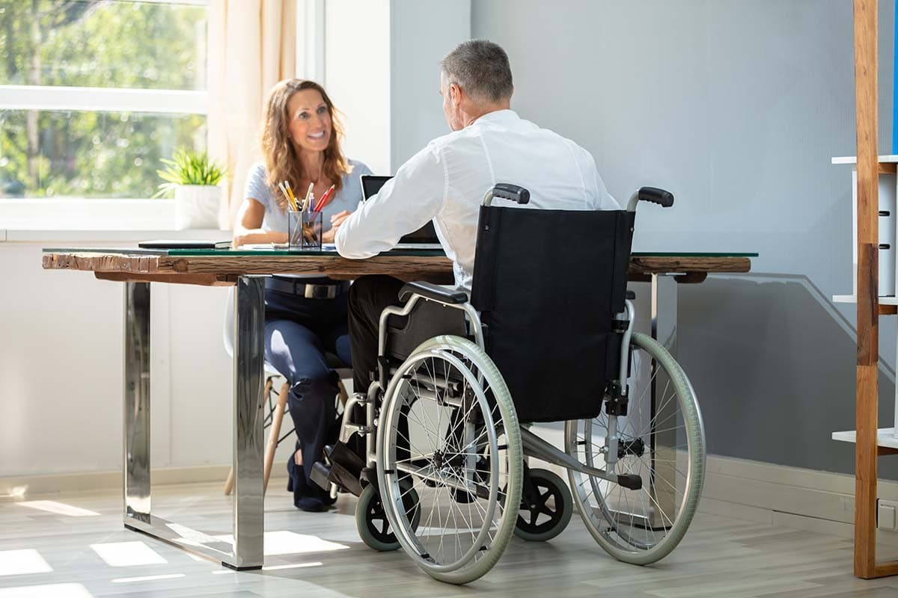

A <strong>home assessment</strong> determines the details of an injured workers’ home and what their specific challenges may be within that home. However, home assessments can come in varying degrees of detail and recommendation. They can also be completed by individuals with varying professional backgrounds. In the workers’ compensation world, you can expect to see life care planners, nurse case managers, facility occupational or physical therapists, home health professionals, accessibility specialists and contractors all performing home assessments.

The American Occupational Therapy Association states,  “Occupational therapy practitioners have a holistic perspective, in which the focus is on adapting the environment and/or task to fit the person, and the person is an integral part of the therapy team. It is an evidence-based practice deeply rooted in science.”

CorHome feels an occupational therapist (OT), who uniquely specializes in home assessments and modifications, is the best fit for this industry. Though many professionals can determine what is needed in a home, few can provide a clear plan to meet the goal of accessibility. Formal education and hands-on patient experience give an OT valuable insight into injuries, diagnoses and the use of DME or adaptive equipment to complete a task. This is known as Task Analysis in OT practice and is crucial to the process. This approach takes an activity and breaks it down to understand the physical, cognitive, social and other processes that the activity generally requires.

So, how does this relate to a home assessment? Sometimes a solution in the home does not require construction or major modifications. Perhaps improved access or safety can be achieved by modifying the room layout and its contents. Positioning and adaptive equipment may be an option. This a conservative approach but a first-line recommendation when guided by an OT.

When you are working with an OT who understands how an injured worker completes a task and the equipment and level of support they require, there is confidence knowing the recommendations will be precise. For example, the placement of your bathroom components in a standard location most likely will not be functional for someone who relies on a shower chair and caregiver assistance for all bathroom tasks. It is critical to understand an injured worker’s unique process and have the freedom to redesign these components in a manner that maximizes their independence and safety while allowing space for caregiver assistance.

One of CorHome’s unique benefits is the ability to work closely with an OT who can solve problems with help from a trusted DME vendor. Together, they can provide creative solutions with DME options for challenging homes. This collaboration can eliminate the need for construction. We can confirm how much space is needed in a new functional design for the injured worker’s current space. With each assessment, we are mindful that equipment is provided to help not hinder, and space should never be wasted.

Consider one of CorHome’s OT professionals for your next home assessment and experience the difference in your result.